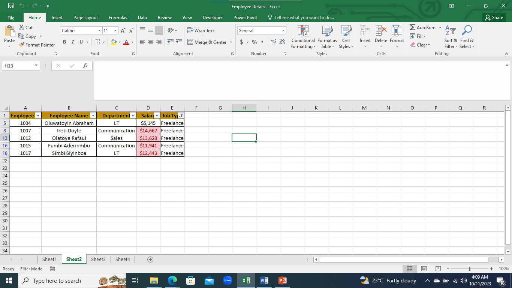
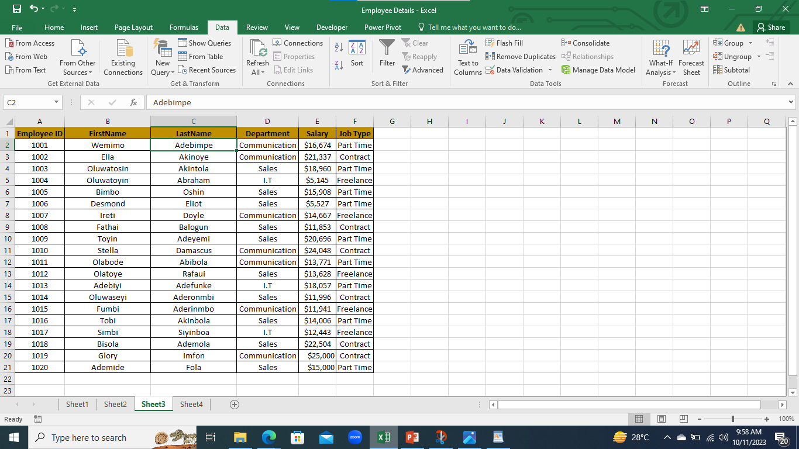

# Excel Task 1

## Introduction

In this **Excel Task**,we were to Create 20 row of information,having five column with headers (Employee ID,Employee Full Name,Department ,Salary ,Job type ).I create this in the first worksheet.
We were ask to copy and paste into two other worksheet containing data; Shown only employees who are ‘Freelancers’ and highlight the ones whose salaries are above 10000,split the employees’ full names into first name and last name. Check for duplicates and highlight, highlight employees whose names begin with the letter ‘E’ (in yellow). Format the Salary column such that the highest SALARY has a green background and the lowest SALARY has a red background.
I Have four worksheet containing the Table created and the three(3) tasks.

**_Disclamier_**:_All Dataset do not represent any individual,institution or company ,but just a dummy set to demonstrate my knowledge of Excel._

## Problem Statement
1. To know how to create a Table.
2. To know how to copy and paste.
3. To know how use use some features like split,data validation,sort and filter.
4.  To know how to highlight with conditional formatting.

## Skill/ Concepts Documented
	The following are excel features used; 
 - copy and paste,
 - Randbetween,
 - Data Validation,
 - Conditional formatting,
 - Sort,
 - Filter.

## Worksheet 1:Table Created

I created by  take this following steps:
1. I created a table with 20 rows and 5 columns
2. The header of the columns were labelled with the headers that were provided with (Employee ID,Employee Full Name,Department ,Salary ,Job type ).
3. The employee ID was generated randomly
4. The Employed Name was created randomly on another worksheet and input on the table by Data validation,This was done by;
a. Going to Data Ribbon,
b. Go to data validation tab,
c. Click list and create list of names,
d. Drop the list you want on the column.
5. The Department was created with the department provided and was input with data validation.
6. The Salary was generated with the Excel formular randbetween,I Use the interval provided .
7.  The Job type created with the job type provided and was input with data validation.

## Worksheet 2: Freelancers

In this worksheet ,only the workers who are freelancers were show and the once which salary is above $10000 were highlighted,And this was done by;
- Filtering the Data;
1. Go to Data ribbon ,
2. Go the filter tab(You filter by the text)
- For Hightling;
1. Go to conditional formatting tab
2. Go to Hightlight cell rules
3. Go Greater than,then type > 10000

## Worksheet 3: SplitNames

In this worksheet ,The fullname was into firstname and lastname,this was done by;
1. Go to Data Ribbon
2. Go to text to column
3. Split by delimter which is space.
- For Duplicate;
1. Go to data ribbion
2. Go to to remove duplicate to check for duplicate OR
- Go to conditional formatting
- Go to New Rules
-  Go to Format only unique'duplicate value and highlight
Note: In this particular data there was no duplicate there I did not highlight any.

## Worksheet 4: NamewithE

In this worksheet ,The Name starting with E was highlighted and the highest and lowest salary was highlighted,this was done by;
- Highlight the letter E ;
1. Go to conditional formatting
2. Go to New rules
3. Go to Format only cell that contain
4. Go to specific text
5.  Go to Begins with
6.  type E
7. when E is located,highlight the color to yellow
- For the higheset and lowest salary highlight;
1. Go to conditional formatting
2. Go to Top/Bottom Rules,For the highest choose top,then set to top 1,highlight to green;For the lowest choose Bottom,then set to Bottom 1,highlight to red.

## Conclusion
How was able to expand my knowledge about excel and learn more new features.
                       

         

